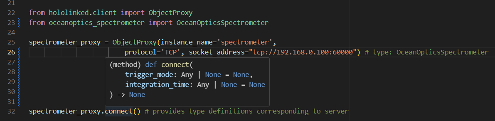

.. |module| replace:: hololinked
 
.. |module-highlighted| replace:: ``hololinked``

.. |br| raw:: html

     

.. toctree::
    :hidden:
    :maxdepth: 2
    
    Expose Python Classes <self>
    parameters/index
    methods/index

    
Expose Python Classes
=====================

Since |module-highlighted| is object oriented, one can start by creating a class to encapsulate 
instrumentation properties and the desirable commands to be issued. Python objects visible
on the network or to other processes are made by subclassing from ``RemoteObject``: 

.. literalinclude:: code/remote_object_inheritance.py
    :language: python
    :linenos:

``instance_name`` is a unique name recognising the instantiated object. It allows multiple 
instruments of same type to be connected to the same computer without overlapping the exposed interface. 
This is mandatory to be supplied to the ``RemoteObject`` parent.  

For attributes (like serial number above), if one requires them to be exposed on the network, one should 
use "parameters" defined in ``hololinked.server.remote_parameters`` to "parameterize" the object. 

.. literalinclude:: code/rpc.py
    :language: python
    :linenos:
    :lines: 2, 6-18

Only parameters can be exposed to the network, not normal python attributes.

For methods to be exposed on the network, one can use the ``remote_method`` decorator. 

.. literalinclude:: code/rpc.py
    :language: python
    :linenos:
    :lines: 3-9, 14-18, 20-28

Arbitrary signature is permitted and arguments are loosely typed in general. 

To start a ``RemoteObject`` server, one can call the ``run()`` method 

.. literalinclude:: code/rpc.py
    :language: python
    :linenos:
    :lines: 5-9, 42-46

By default, this starts a server which listens at three levels - a TCP socket, 
interprocess communication (ZMQ's IPC) & intra-process communication (ZMQ's INPROC). 
Because the speed of message passing is different for each transport method, these three 
possibilities are available & one can select one's requirements. 

To connect to the server to invoke the methods & read-write parameters, one can use an object proxy 
available in ``hololinked.client``:

.. literalinclude:: code/rpc_client.py
    :language: python
    :linenos: 
    :lines: 1-20

One would be making such remote procedure calls from a PyQt graphical interface or custom acquisition scripts 
which may be running in the same or a different computer on the network.

If one needs type definitions for the client because the client does not know 
the server to which it is connected, one can import the server script ``RemoteObject`` and set 
it as the type of the client. 

.. literalinclude:: code/rpc_client.py 
    :language: python
    :linenos: 
    :lines: 22-28

For python to python, an interface definition language is not necessary as the client attributes, methods etc.
will be constructed dynamically after locating the server. It is suggested to use type definitions instead.  

  
|br|
One can store captured data in parameters & push events to supply clients with the measured data:

.. literalinclude:: code/rpc.py 
    :language: python   
    :linenos:
    :lines: 6-16, 19, 28-40

On the client side, one can subscribe to the event to receive the data:

.. literalinclude:: code/rpc_client.py 
    :language: python 
    :linenos: 
    :lines: 22-32